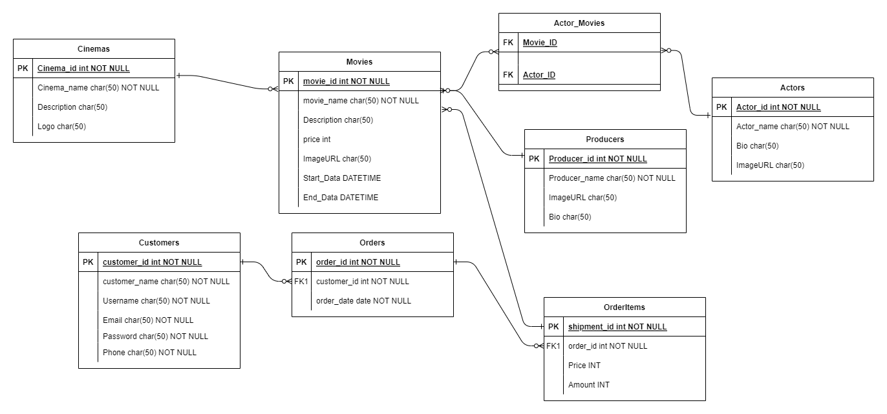

# Box-AM-Office

## Team 

1. Sultan Kanaan 
2. HamZa Samha
3. Haneen Al-Hamdan
4. Islam Alsawaftah

# Introduction
In this project, We simulated the back-end of a box Office system using ASP.Net Core. Our aim was to comply with SOLID coding principles while performing this simulation.

The box office in a theatre, cinema, or concert hall is the place where the tickets are sold. When people talk about the box office, they are referring to the degree of success of a film or play in terms of the number of people who go to watch it or the amount of money it makes.

---

## [Wireframe]()

---

## User Stories

### Admin Dashboard

* As an administrator, I would like to have a dashboard where I can see a list of Movies

* As an administrator, I would like to view a detail page for each Movies so that I can eventually edit its data or delete it
*  As an administrator, I would like to view a detail page for each Actor so that I can eventually add, edit its data or delete it
*  As an administrator, I would like to view a detail page for each Cinema so that I can eventually Add, edit its data or delete it
*  As an administrator, I would like to view a detail page for each Producer so that I can eventually Add, edit its data or delete it

* As an administrator, I would like to see a list of the Movies assigned to a Cinema on the Cinema details page
* As an administrator, I would like to see a list of the Actor assigned to a Movies on the Movies details page
* As an administrator , I would like to see a list of the Producer assigned to a Movies on the Movies details page

* As an administrator I would like upload a picture for each Movies,Cinema,Actor and Producer  so that my shoppers will know what our Movies look like

* As an administrator I would like replace a picture for each Movies so that I can keep my inventory up to date
* As an administrator, I would like a preview of my Movies listings so that I can see what my customers will see in the online store

### Consumer Site

* As a user, I would like to see Movies available for sale so that I can browse through the inventory for purchase.
* As a user, I would like to register for an account on the site, so that I can make purchases
* As a user, I would like to securely login to my account so that I can add products to my shopping cart
* As a user, I would like a way to store the items I wish to purchase in a cart within the application.
* As a user, I would like the ability to view my desired purchases while browsing the other products on the site.
* As a user I would like a dedicated page where I can view all the Movies I wish to purpose all in one location.

---

## [Domain Modeling](https://user-images.githubusercontent.com/98957434/179357128-5c3840ed-6009-45da-8138-ae8795518053.jpg)

---

## Database Schema Diagram

* **Movie**
Movieis a class which holds the properties 
Name, Description, Price, ImageURL, StartDate,EndDate, MovieCategory

* **Cinema** 
Has Foreign Key MovieId, It has the properties of Name, Logo, Description
 
 * **Actor**
 Actor a class which holds the properties 
 Name , Bio , ProfilePictureURL

 * **Producer**
 Producer a class which holds the properties 
 Name , Bio , ProfilePictureURL
 
 
 * **Order** 
 The simple class have properties UserId, Email, OrderItems
 
 * **OrderItem** 
 Another simple class has properties  Id ,Amount ,Price ,MovieId , OrderId 

---

## Cooperation Plan
Everyone in our team is collaborative and ready to self-learning.
We'll hold a daily meeting to discuss our progress and next steps.

---

## Conflict Plan
If a team member is late or unable to complete a task, we will divide it into portions and assign it to a different team member.
If a disagreement arises, we shall vote to resolve it.

---

## Communication Plan
We'll have a Zoom meeting at 5 p.m. for around 4 hours, and we have a Slack channel where we'll speak with each other beyond work hours and on weekends.

---

## Work Plan
Each needed work should be divided into subtasks and assigned to each team member based on his or her key strengths.

Our tool is Github it's useful for any stakeholder in the development of the project and not just the project managers. They are dynamic tools that can be completely altered to facilitate the needs of teams with different sizes and goals.

---

## Git Process
We have a table of tasks with deadline and status for each one.

| Tasks | Deadline | Status | 
|:-|:-|:-| 
| Planning | 15/7/2022 | Completeed |
| Diagram | 16/7/2022 | Completeed | 
| Entity FrameWork | 17/7/2022 | Completeed | 
| Services | 17/7/2022 | incomplete | 
| Controllers | 18/7/2022 | incomplete | 
| Identity | 19/7/2022 | incomplete | 
| view | 20/7/2022 | incomplete | 
